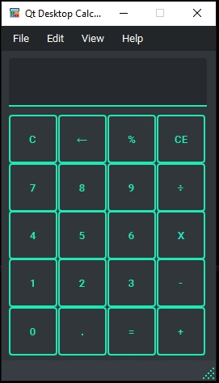
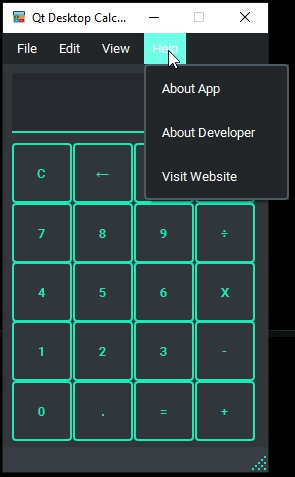
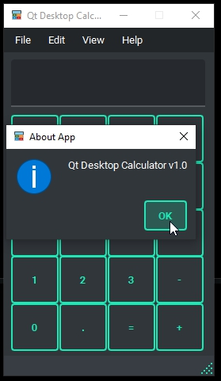
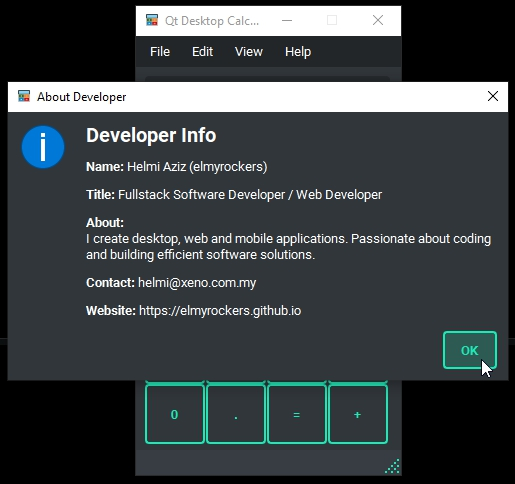

# Qt-Desktop-Calculator
Simple Qt-based desktop calculator made with PySide6 (Qt for Python).

---

## Features
- Basic arithmetic operations: addition, subtraction, multiplication, division  
- Clear and backspace functionality  
- Responsive layout using QGridLayout  
- Lightweight and cross-platform

---

## Technologies Used
- Python 3
- PySide6 (Qt for Python)

---

## Preview

	

	

	

	

---

## Purpose
This project was developed as part of my personal portfolio to demonstrate skills in:
- GUI development using Qt Widgets
- Event-driven programming in Python

---

## Notice
This project is for **portfolio showcase purposes only** and not intended for reuse or redistribution.
